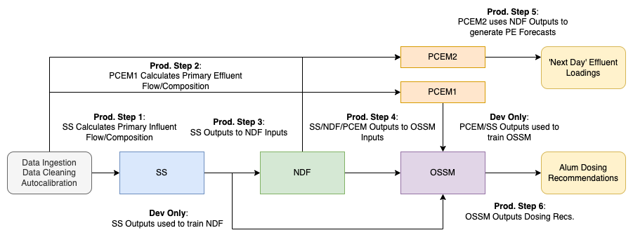
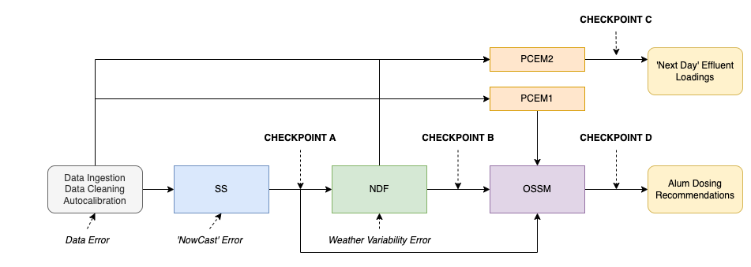
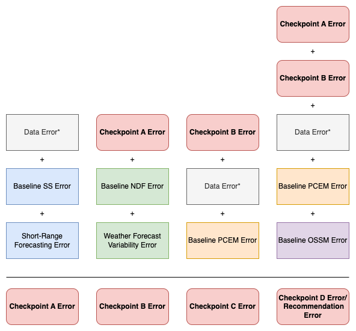

# CWS Durham ODIN Component Overview and Error Evaluation

## CWS Durham ODIN Components

The ODIN Hybrid Digital Twin Optimizer at CWS Durham consists of four ‘Core’ Components:

- [Primary Clarifier Influent Soft Sensor Model (SS)](link-to-more-info)
- [Forecaster Model (Forecaster)](link-to-more-info)
- [Primary Clarifier Digital Twin (Dig. Twin)](link-to-more-info)
- [Simulator/Optmizer (Optimizer)](link-to-more-info)

...and three 'Data Processing' Components:
- [Data Ingestion](link-to-more-info)
- [Data Cleaning](link-to-more-info)
- [Model Autocalibration](link-to-more-info)

### Functions of ODIN Core Components

- **SS:** Calculate primary influent composition from facility aeration rates up to current time (‘NowCast’).
- **Forecaster:** Forecast primary influent composition over the next 24 hours.
- **Dig. Twin:** Calculate primary clarifier effluent flow and composition.
- **Optimizer:** Forecast optimized alum dosing recommendations from observed/forecasted influent and effluent flows/compositions, and select calibration values.

### Core Component Functioning when ODIN is run (daily at 0700 PT)

#### Figure 1. Diagram of CWS Durham ODIN Production Run.

Core component functions when ODIN is run are diagrammed in Figure 1 and described as follows:

- **Prod. Step 1:** SS generates primary influent profiles up to ‘now’.
- **Prod. Step 2:** Dig. Twin calculates the primary effluent composition and flows up to the current time.
- **Prod. Step 3:** Forecaster generates next 24 hours of primary influent profiles.
- **Prod. Step 4:** Optimizer generates recommended alum dosings from historical/forecaster primary influent profiles, historical primary effluent profiles, select calibration values, and primary effluent orthophosphate load target.
- **Prod. Step 5:** Dig. Twin calculates the next 24 hours primary effluent composition and flows based on forecaster results.

#### Development Only Steps

- The use of SS results to train the forecaster model.
- The use of Dig. Twin/SS results to train the optmizer model.

### Objective Outputs

- **Recommended Primary Clarifier Alum Dosing Recommendations:**
  - Generated at the end of Step 4
- **Forecasted 'Next Day' Primary Clarifier Effluent Loads:**
  - Generated at the end of Step 5

## ODIN System Error Breakdown

### Systematic Errors

Systematic errors are inherent flaws in data processing and handling methods within a system, such as during data cleaning or autocalibration. These errors, like improper data imputation, degrade data quality and are hard to isolate and measure due to their embedded nature in the system's methodology. Their impact is consistent across different types of data evaluations, affecting both historical and real-time analyses uniformly.

### Baseline Errors

Each core component of our model has a unique 'baseline' error, identified during the model development phase. These baseline errors represent the inherent inaccuracies of the model under ideal conditions, where all data is complete and inputs are certain. For machine learning models, this baseline error is calculated as the average error across the testing sets of each of the five k-folds used in training. We assess the accuracy of our model outputs by comparing them with actual observations from CWS Durham, using the Mean Average Percentage Error (MAPE) as our primary metric of evaluation. Detailed analyses and results of these baseline evaluations are accessible in the provided notebook [here](link-to-notebook).

### Production Environment Error Sources

In a production environment, additional sources of error emerge that go beyond the baseline errors. These arise primarily due to data-related issues and uncertainties about future states. These errors, while impacting the core components, are analyzed independently here:

- Data-Lag Related Errors
- Short-Range Forecasting of Aeration Rates ('NowCasting')
- Weather Forecast Variability

#### Production Environment Error Explanations and Assessments

Below are more detailed explanations of these errors and methodologies for their assessment, either directly or by examining their downstream effects:

- **Data  Lag Error**
  - This error is associated with delays in data availability, particularly relevant for laboratory data (LIMs) and to some extent, SCADA data, which are integral to the SUMO SS and Dig. Twin models. An indirect assessment of data lag impact can be done by comparing real-time model performance with historical data evaluations. This comparison helps gauge the extent to which delayed data affect model accuracy.

- **Short-Range Forecasting or ‘NowCast’ of Aeration Rates**
  - The process of creating influent profiles from aeration rates involves a delay equal to the Hydraulic Retention Time (HRT) from the primary influent through the aeration stage. This necessitates forecasting or ‘NowCasting’ the aeration rates for the last 12 hours to estimate current influent profiles accurately. The accuracy of these short-range forecasts can be evaluated by comparing the first run's data from 1900-0700 hours with the corrected data from the same period on the following day. This comparison helps determine the percentage error in the short-range forecasts.

- **Weather Forecast Variability**
  - The Forecaster model is trained using historical weather data, but future influent flow forecasting requires reliance on weather forecasts. The accuracy of these forecasts can be assessed by comparing the predicted weather conditions with the actual observed conditions over the same period. This comparison helps quantify the discrepancy between forecasted and actual weather conditions, providing insight into the variability and reliability of weather forecasts used in modeling.

### Error Checkpoints in Production Workflow

To effectively gauge the impact of these errors, our strategy extends beyond direct measurement of individual error types. We focus on comprehending their cumulative effect on the entire production workflow. To facilitate this, we've set up various 'checkpoints' strategically placed throughout the workflow. These checkpoints enable us to observe and trace the progression of errors as they move through the entire production process. This methodology and its implementation are visually illustrated in Figure 2 below.

#### Figure 2. Diagram of CWS ODIN Error Checkpoints.

Each checkpoint is a combination of systematic, baseline error, production environment error, and/or previous checkpoint error. Figure 3 shows how the error stacks for each checkpoint ultimately resulting in the observed error of the ODIN outputs at Checkpoinat C/Checkpoint D:

#### Figure 3. Diagram of CWS ODIN Error Stacking for each Checkpoint.

**Data Lag Error is not included in checkpoint error of historical evaluation periods

## Checkpoint Error Evaluation

### Evaluation Periods

Our evaluation approach is bifurcated into two distinct categories: historical evaluations and live model evaluations. Historical evaluations are conducted without considering data delay errors, whereas live model evaluations incorporate these errors. The designated time frames for these evaluations are as follows:

- **Historical Evaluation Period 1:** April 1, 2023 to June 30th, 2023
- **Historical Evaluation Period 2:** July 1, 2023 to September 28, 2023
- **Historical Evaluation Period 3:** October 1, 2023 to December 31, 2023
- **Live Model Evaluation Period 1:** October 1, 2023 to December 31, 2023* 

Notably, these evaluation periods utilize distinct machine learning (ML) models, each specifically developed for the corresponding time frame. For each period, we deploy ML models that were trained and validated exclusively with data acquired prior to the start of that period. The live model evaluation period is particularly significant as it coincides with the operational phase of the latest iteration of the SS/Dig. Twin models, demonstrating its real-time performance post the latest update.

Error analysis at each checkpoint is conducted by comparing the checkpoint data values against the actual data recorded at CWS Durham during the same period. The Mean Average Percentage Error (MAPE) is the preferred metric for this analysis.

### Error Checkpoint A

Checkpoint A represents a convergence of various error types: systematic error, data lag errors (during live model periods), the inherent baseline error of the SS model, and the errors arising from the short-range 'NowCast' function within the SS model. For a detailed analysis and evaluation of Checkpoint A, you can refer to the comprehensive notebook provided [here](link-to-notebook).

- **Historical Evaluation Period 1**
    - *Primary Influent Daily Flow (MGD)* - **MAPE: (?.? ± ?.?%)**
        - Average Observed Value: (?.? ± ?.?)
        - Average Predicted Value: (?.? ± ?.?)
        
    - *Primary Influent Orthophosphate Load (lbs/day)* - **MAPE: (?.? ± ?.?%)**
        - Average Observed Value: (?.? ± ?.?)
        - Average Predicted Value: (?.? ± ?.?)

    - *Primary Influent Ammonia Load (lbs/day)* - **MAPE: (?.? ± ?.?%)**
        - Average Observed Value: (?.? ± ?.?)
        - Average Predicted Value: (?.? ± ?.?)

 

- **Historical Evaluation Period 2**
    - *Primary Influent Daily Flow (MGD)* - **MAPE: (?.? ± ?.?%)**
        - Average Observed Value: (?.? ± ?.?)
        - Average Predicted Value: (?.? ± ?.?)
        
    - *Primary Influent Orthophosphate Load (lbs/day)* - **MAPE: (?.? ± ?.?%)**
        - Average Observed Value: (?.? ± ?.?)
        - Average Predicted Value: (?.? ± ?.?)

    - *Primary Influent Ammonia Load (lbs/day)* - **MAPE: (?.? ± ?.?%)**
        - Average Observed Value: (?.? ± ?.?)
        - Average Predicted Value: (?.? ± ?.?)

 

- **Live Model Evaluation Period 1**
    - *Primary Influent Daily Flow (MGD)* - **MAPE: (?.? ± ?.?%)**
        - Average Observed Value: (?.? ± ?.?)
        - Average Predicted Value: (?.? ± ?.?)
        
    - *Primary Influent Orthophosphate Load (lbs/day)* - **MAPE: (?.? ± ?.?%)**
        - Average Observed Value: (?.? ± ?.?)
        - Average Predicted Value: (?.? ± ?.?)

    - *Primary Influent Ammonia Load (lbs/day)* - **MAPE: (?.? ± ?.?%)**
        - Average Observed Value: (?.? ± ?.?)
        - Average Predicted Value: (?.? ± ?.?)

 

### Error Checkpoint B

Checkpoint B integrates the error from Checkpoint A with the additional error originating from the forecaster model. This includes errors due to weather forecast variability. It's key to remember that data lag errors, which are linked to input delays and part of Checkpoint A's error composition, are exclusively factored into the Live Model Evaluation Periods. For a thorough evaluation and understanding of Checkpoint B, the detailed notebook is available [here](link-to-notebook).

- **Historical Evaluation Period 1**
    - *Primary Influent Daily Flow (MGD)* - **MAPE: (?.? ± ?.?%)**
        - Average Observed Value: (?.? ± ?.?)
        - Average Predicted Value: (?.? ± ?.?)
        
    - *Primary Influent Orthophosphate Load (lbs/day)* - **MAPE: (?.? ± ?.?%)**
        - Average Observed Value: (?.? ± ?.?)
        - Average Predicted Value: (?.? ± ?.?)

    - *Primary Influent Ammonia Load (lbs/day)* - **MAPE: (?.? ± ?.?%)**
        - Average Observed Value: (?.? ± ?.?)
        - Average Predicted Value: (?.? ± ?.?)

 

- **Historical Evaluation Period 2**
    - *Primary Influent Daily Flow (MGD)* - **MAPE: (?.? ± ?.?%)**
        - Average Observed Value: (?.? ± ?.?)
        - Average Predicted Value: (?.? ± ?.?)
        
    - *Primary Influent Orthophosphate Load (lbs/day)* - **MAPE: (?.? ± ?.?%)**
        - Average Observed Value: (?.? ± ?.?)
        - Average Predicted Value: (?.? ± ?.?)

    - *Primary Influent Ammonia Load (lbs/day)* - **MAPE: (?.? ± ?.?%)**
        - Average Observed Value: (?.? ± ?.?)
        - Average Predicted Value: (?.? ± ?.?)

 

- **Live Model Eval Period 1**
    - *Primary Influent Daily Flow (MGD)* - **MAPE: (?.? ± ?.?%)**
        - Average Observed Value: (?.? ± ?.?)
        - Average Predicted Value: (?.? ± ?.?)
        
    - *Primary Influent Orthophosphate Load (lbs/day)* - **MAPE: (?.? ± ?.?%)**
        - Average Observed Value: (?.? ± ?.?)
        - Average Predicted Value: (?.? ± ?.?)

    - *Primary Influent Ammonia Load (lbs/day)* - **MAPE: (?.? ± ?.?%)**
        - Average Observed Value: (?.? ± ?.?)
        - Average Predicted Value: (?.? ± ?.?)

 

### Error Checkpoint C

Checkpoint C not only captures the aggregate error from Checkpoint B along with additional data lag errors related to Dig. Twin inputs and the Dig. Twin model's baseline error, but it also specifically represents the error in the 'Next Day' Primary Clarifier Effluent Loads output. This detail underscores the importance of Checkpoint C in assessing the accuracy of predictions for upcoming effluent loads. Data input delay errors are included exclusively in the Live Model Evaluation Periods. For comprehensive insight and evaluation of Checkpoint C, including its role in predicting 'Next Day' effluent loads, the relevant notebook is available [here](link-to-notebook).

- **Historical Evaluation Period 1**
    - *Primary Effluent Daily Flow (MGD)* - **MAPE: (?.? ± ?.?%)**
        - Average Observed Value: (?.? ± ?.?)
        - Average Predicted Value: (?.? ± ?.?)
        
    - *Primary Effluent Orthophosphate Load (lbs/day)* - **MAPE: (?.? ± ?.?%)**
        - Average Observed Value: (?.? ± ?.?)
        - Average Predicted Value: (?.? ± ?.?)

    - *Primary Effluent Ammonia Load (lbs/day)* - **MAPE: (?.? ± ?.?%)**
        - Average Observed Value: (?.? ± ?.?)
        - Average Predicted Value: (?.? ± ?.?)

 

- **Historical Eval Period 2**
    - *Primary Effluent Daily Flow (MGD)* - **MAPE: (?.? ± ?.?%%)**
        - Average Observed Value: (?.? ± ?.?)
        - Average Predicted Value: (?.? ± ?.?)
        
    - *Primary Effluent Orthophosphate Load (lbs/day)* - **MAPE: (?.? ± ?.?%)**
        - Average Observed Value: (?.? ± ?.?)
        - Average Predicted Value: (?.? ± ?.?)

    - *Primary Effluent Ammonia Load (lbs/day)* - **MAPE: (?.? ± ?.?%)**
        - Average Observed Value: (?.? ± ?.?)
        - Average Predicted Value: (?.? ± ?.?)

 

- **Live Model Eval Period 1**
    - *Primary Effluent Daily Flow (MGD)* - **MAPE: (?.? ± ?.?%)**
        - Average Observed Value: (?.? ± ?.?)
        - Average Predicted Value: (?.? ± ?.?)
        
    - *Primary Effluent Orthophosphate Load (lbs/day)* - **MAPE: (?.? ± ?.?%)**
        - Average Observed Value: (?.? ± ?.?)
        - Average Predicted Value: (?.? ± ?.?)

    - *Primary Effluent Ammonia Load (lbs/day)* - **MAPE: (?.? ± ?.?%)**
        - Average Observed Value: (?.? ± ?.?)
        - Average Predicted Value: (?.? ± ?.?)

 

### Error Checkpoint D

Checkpoint D, also known as the optimized recommendation error, encompasses a comprehensive error calculation that includes errors from Checkpoints A and B, assorted data lag-related errors, and the baseline errors of both the PCEM and OSSM models. To evaluate the accuracy of these recommendations, we employ a unique approach. We compare the 'adjusted' recommendations, which are based on using the next day's observed primary effluent orthophosphate loads at the targeted input, against the actual alum dosing concentrations observed on the following day. This comparison is crucial for assessing the discrepancy between our suggested dosing recommendations and the actual dosing practices.

However, a critical point to note is that during the live model evaluation period, alum dosing was not in practice. This means that the findings from this period are not directly applicable to scenarios where alum dosing is being actively conducted. For a detailed analysis and evaluation of Checkpoint D, the comprehensive notebook is available [here](link-to-notebook).

- **Historical Evaluation Period 1**
    - *Primary Clarifier Alum Dosing Conc. (g/ml)* - **MAPE: (?.? ± ?.?%)**
        - Average Observed Value: (?.? ± ?.?)
        - Average Predicted Value: (?.? ± ?.?)

 

- **Historical Evaluation Period 2**
    - *Primary Clarifier Alum Dosing Conc. (g/ml)* - **MAPE: (?.? ± ?.?%)**
        - Average Observed Value: (?.? ± ?.?)
        - Average Predicted Value: (?.? ± ?.?)

 

- **Live Model Evaluation Period 1**
  - N/A

 

## Isolated Error Types Evaluation

Beyond assessing checkpoint errors, we also focus on individually identifying and analyzing various error sources within the ODIN system. This detailed examination aims to enhance the overall system performance. The key error types we scrutinize include baseline errors, production environment errors, and data lag errors.

### Model Baseline Errors

- **Baseline SS Error**
    - *Primary Influent Daily Flow (MGD)* - **MAPE: (?.? ± ?.?%)**
        - Average Observed Value: (?.? ± ?.?)
        - Average Predicted Value: (?.? ± ?.?)
        
    - *Primary Influent Orthophosphate Load (lbs/day)* - **MAPE: (?.? ± ?.?%)**
        - Average Observed Value: (?.? ± ?.?)
        - Average Predicted Value: (?.? ± ?.?)

    - *Primary Influent Ammonia Load (lbs/day)* - **MAPE: (?.? ± ?.?%)**
        - Average Observed Value: (?.? ± ?.?)
        - Average Predicted Value: (?.? ± ?.?)

- **Baseline Forecaster Error**
     - *Primary Influent Daily Flow (MGD)* - **MAPE: (10.99 ± ?.?%)**
        - Average Observed Value: (?.? ± ?.?)
        - Average Predicted Value: (?.? ± ?.?)
        
    - *Primary Influent Orthophosphate Load (lbs/day)* - **MAPE: (6.19 ± ?.?%)**
        - Average Observed Value: (?.? ± ?.?)
        - Average Predicted Value: (?.? ± ?.?)

    - *Primary Influent Ammonia Load (lbs/day)* - **MAPE: (6.4 ± ?.?%)**
        - Average Observed Value: (?.? ± ?.?)
        - Average Predicted Value: (?.? ± ?.?)

- **Baseline Dig. Twin Error**
     - *Primary Effluent Daily Flow (MGD)* - **MAPE: (?.? ± ?.?%)**
        - Average Observed Value: (?.? ± ?.?)
        - Average Predicted Value: (?.? ± ?.?)
        
    - *Primary Effluent Orthophosphate Load (lbs/day)* - **MAPE: (?.? ± ?.?%)**
        - Average Observed Value: (?.? ± ?.?)
        - Average Predicted Value: (?.? ± ?.?)

    - *Primary Effluent Ammonia Load (lbs/day)* - **MAPE: (?.? ± ?.?%)**
        - Average Observed Value: (?.? ± ?.?)
        - Average Predicted Value: (?.? ± ?.?)

- **Baseline Optimizer Error**
    - *Primary Clarifier Alum Dosing Conc. (g/ml)* - **MAPE: (?.? ± ?.?%)**
        - Average Observed Value: (?.? ± ?.?)
        - Average Predicted Value: (?.? ± ?.?)

### Production Environment Error

Some of the production environment error can be indirectly or directly assesed either by impact on checkpoint accuracy or by error of the forecast itself.

#### Data Lag Error

Because data lag was not present during the live model evaluation period, we have the opportunity to contrast the results from this period with those from the historical evaluation periods. This comparison, where data lag is the sole differing factor, provides us with a rough estimate of the data lag's impact. However, it's important to note that this comparison is not applicable to Checkpoint D, as there was no alum dosing conducted during the live model evaluation period.

- **Average Change of MAPE Between Historical Evaluation Period (n=3) and Live Model Eval Period (n=1) (Data Lag Impact)**
    - Checkpoint A Historical vs. Checkpoint A Live (?.?%) (?.?%) (?.?%)
    - Checkpoint B Historical vs. Checkpoint B Live (?.?%) (?.?%) (?.?%)
    - Checkpoint C Historical vs. Checkpoint C Live (?.?%) (?.?%) (?.?%)

#### Short-Range Forecasting 'NowCast' Error

The precision of the 'NowCast' can be effectively evaluated by juxtaposing it with subsequently corrected values. These corrected values are obtained when the soft sensor is operated the following day, guaranteeing that the inputs used for the comparison are precise and reliable. This assessment specifically targets the error in the forecasted aeration rates across various evaluation periods:

- **Forecasted Aeration Rate Error**
    - Historical Eval Period 1 (?.?%)
    - Historical Eval Period 2 (?.?%)
    - Live Model Eval Period 1 (?.?%)

#### Weather Variability Error

When we have access to both forecasted and observed weather conditions, it enables us to accurately quantify the error in specific weather metrics. Our analysis is centered on identifying and evaluating the differences between what was forecasted and the actual weather measurements observed.

- **Forecasted Temperature Error (Celsius)**
    - Historical Eval Period 1 (?.?%)
    - Historical Eval Period 2 (?.?%)
    - Live Model Eval Period 1 (?.?%)

- **Forecasted Precipation Error (mm)**
    - Historical Eval Period 1 (?.?%)
    - Historical Eval Period 2 (?.?%)
    - Live Model Eval Period 1 (?.?%)

#### Other Potential Error Sources

In addition to the identified error sources, there may be other potential errors within the system that could affect its accuracy and reliability. These could stem from factors such as unaccounted environmental variables, unforeseen technical glitches in data collection or processing, or even subtle changes in the operational environment that haven't been previously considered. Identifying and understanding these latent errors is crucial for further refining the system's performance and ensuring robust results.

---