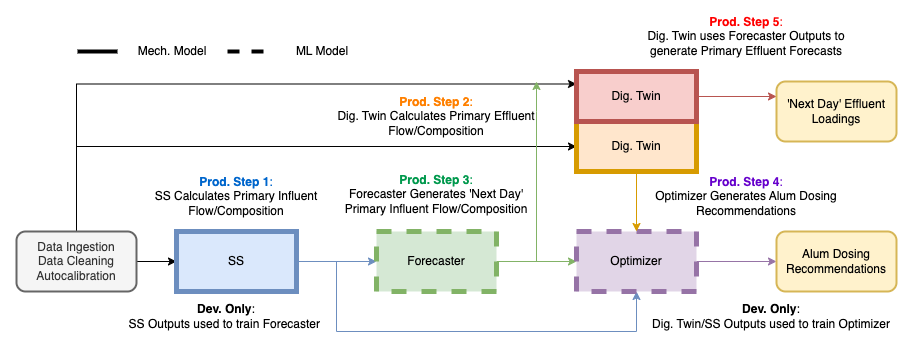
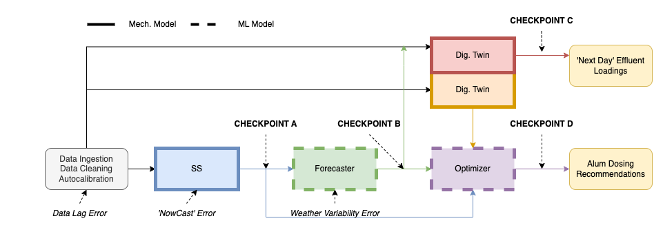

# Clean Water Services' Durham WRRF ODIN Hybrid Optimizer

## Durham Water Resource Recovery Facility
Clean Water Services' Durham Water Resource Recovery Facility, located in Tigard, Oregon, is a state-of-the-art facility for wastewater treatment and resource recovery, processing 26 million gallons daily. This facility adeptly combines chemical and biological methods to remove phosphorus, effectively meeting the stringent phosphorus limits (TMDL of 0.1 mg/l) during Oregon's dry season (May to October). While biological removal is preferred, the use of chemical precipitates like aluminum sulfate (alum) helps control orthophosphate levels in the aeration basins where biological uptake occurs. Managing flows and nutrient loads remains a challenge, often requiring operators to adjust chemical dosing reactively. Improved forecasts of flows and loads, along with optimized dosing strategies, could enhance operational efficiency, reduce chemical usage, and ensure compliance with phosphorus limits.

## ODIN Hybrid Optimizer Objective
The overall objective of the Operational Decision and Information Network (ODIN) Hybrid Optimizer is to provide accurate forecasts of primary clarifier effluent flow and nutrient loads to the operational staff. Alongside these forecasts, the system will offer recommendations for primary clarifier alum dosing. This approach aims to shift treatment strategies from reactive to proactive, enhancing both the efficiency and efficacy of the treatment process.

## CWS Durham ODIN Hybrid Optimizer Components

The ODIN Hybrid Digital Twin Optimizer at CWS Durham consists of four ‘Core’ Components:

- [Primary Clarifier Influent Soft Sensor Model (SS)](link-to-more-info)
- [Forecaster Model (Forecaster)](link-to-more-info)
- [Primary Clarifier Digital Twin (Dig. Twin)](link-to-more-info)
- [Simulator/Optmizer (Optimizer)](link-to-more-info)

...and three 'Data Processing' Components:
- [Continous Data Ingestion](link-to-more-info)
- [Automated Data Cleaning](link-to-more-info)
- [Model Autocalibration](link-to-more-info)

### Functions of ODIN Core Components

- **SS:** Calculate primary influent flow and composition from facility aeration rates up to current time.
- **Forecaster:** Forecast primary influent flow and composition over the next 24 hours.
- **Dig. Twin:** Calculate primary clarifier effluent flow and composition.
- **Optimizer:** Generate optimized alum dosing recommendations for a desired ("target") primary effluent orthophosphate load from influent/effluent flows/compositions and select calibration values.

## ODIN Hybrid Architecture

The core of the ODIN system is a hybrid architecture combining a mechanistic digital twin model with machine learning enhancements. This innovative blend leverages the precision and reliability of mechanistic approaches with the adaptability and predictive power of machine learning, creating a comprehensive and dynamic system for wastewater treatment.

### Mechanistic Model (SS/Dig. Twin)
This model, implemented in SUMO, represents the process from primary clarifier influent to secondary clarifier influent on train 1 at CWS Durham, functioning in two key roles:
- **Dual Functionality**:
  - Serves as both the primary clarifier influent soft sensor model and the primary clarifier digital twin model. By closely mirroring the actual operations of the facility, this model provides a detailed and accurate representation of the treatment processes, enhancing both monitoring and control capabilities.
- **Interpretability and Diagnostic Support**:
  - Provides critical interpretability for diagnostics and complex operational decision-making. This feature allows operators to understand the underlying mechanisms of the treatment process, facilitating better-informed decisions and more effective troubleshooting.
- **Data Quality and Compression**:
  - Acts as a filter, ensuring high-quality data and facilitating efficient data compression. By refining the input data, the model ensures that the subsequent machine learning processes are based on accurate and relevant information, enhancing overall model performance.
- **Synthetic Dataset Generation**:
  - Enables the creation of synthetic datasets for scenarios not observed at the facility, expanding the scope and diversity of training data. This capability is essential for modeling and preparing for rare or unprecedented events, thereby improving the system's resilience and adaptability.

### Machine Learning Models (Forecaster/Optimizer)
Machine learning models in the ODIN system are utilized for advanced forecasting and optimization, with distinctive training methodologies:
- **Training on Mechanistic Outputs**:
  - Models are trained using data from the mechanistic models rather than direct observations from the facility, aligning 'accuracy' with the mechanistic outputs.
- **Advantages**:
  - **Enhanced Training Data Quality**:
    - The mechanistic model's outputs provide high-quality, filtered data for machine learning training.
  - **Expanded Training Set Scope**:
    - Allows for the inclusion of rare events and balanced datasets, crucial for developing high-performing machine learning models.
  - **Rapid Simulation Capabilities**:
    - Offers fast simulation speeds, essential for efficient optimization and other operational tasks.

### Advantages of Hybrid System
The hybridization of mechanistic and machine learning models in the ODIN architecture offers several key benefits:
- **Comprehensive Data Analysis**:
  - Merges the detailed interpretability of mechanistic models with the predictive efficiency of machine learning.
- **Quality-Assured Training Data**:
  - Ensures reliable machine learning training with data refined and validated by the mechanistic models.
- **Broadened Operational Insight**:
  - Facilitates training on a wider range of scenarios, including rare and unobserved events, for more robust model performance.
- **Operational Efficiency and Speed**:
  - Enhances decision-making processes with the machine learning models' ability to rapidly simulate and optimize tasks.

## ODIN Hybrid Optimizer in 'Real-Time' Operations

The ODIN Hybrid Optimizer is designed for optimal efficiency in real-time operations. Its data processing components operate continuously, ensuring that inputs fed into the system are of the highest quality and accuracy. To align with daily operational needs, the core components of the ODIN Hybrid Optimizer are scheduled to run at 0700 PT each morning. This timing is strategically chosen to provide daily alum dosing recommendations to the operations staff, facilitating proactive and informed decision-making. The specific functions and processes activated when ODIN runs are detailed in Figure 1 and further described in the accompanying text.

#### Figure 1. Diagram of CWS Durham ODIN Production Run.

- **Prod. Step 1:** SS generates primary influent profiles up to current time. (Mechanistic/ML)
- **Prod. Step 2:** Dig. Twin calculates the primary effluent composition and flows up to the current time. (Mechanistic)
- **Prod. Step 3:** Forecaster generates next 24 hours of primary influent profiles. (ML)
- **Prod. Step 4:** Optimizer generates recommended alum dosings from historical/forecaster primary influent profiles, historical primary effluent profiles, select calibration values, and primary effluent orthophosphate load target.(ML)
- **Prod. Step 5:** Dig. Twin calculates the next 24 hours primary effluent composition and flows based on forecaster results. (Mechanistic)

### Real-Time Outputs of ODIN Hybrid Optimizer

- **Recommended Primary Clarifier Alum Dosing Recommendations:**
  - Generated at the end of Step 4
- **Forecasted 'Next Day' Primary Clarifier Effluent Loads:**
  - Generated at the end of Step 5

## Understanding ODIN Hybrid Optimizer Performance and Error

For the ongoing enhancement of the ODIN Hybrid Optimizer and the advancement of hybrid digital twin technologies, a comprehensive understanding of the system's performance and error dynamics is essential. By tracking and analyzing the sources of error and their propagation within the system, it becomes possible to pinpoint underperforming components. This identification is crucial for facilitating targeted improvements or, if necessary, the development of new architectural solutions to mitigate significant error accumulation. The importance of this analysis is underscored by the fact that the ODIN Hybrid Optimizer is among the pioneering implementations of hybrid digital twin systems. A detailed examination of the distinct error sources within the system is provided in the sections that follow.

### Systematic Errors

Systematic errors are intrinsic inaccuracies that arise from flaws in data collection, processing, and handling methods within a system. These errors can be exemplified by the noisy and often suboptimal quality of data environments in wastewater treatment plants, such as missing data or incorrect readings. Additional examples include errors stemming from inadequate data cleaning or calibration processes. While these errors can significantly influence the overall performance of the model, they are challenging to identify and quantify due to their deeply integrated nature within the system's operational framework. Despite this, the consistent impact of systematic errors across various types of data evaluations, including both historical and real-time analysis, provides a basis for distinguishing other types of errors within the system.

### Baseline Model Errors

Each core component or model within the ODIN Hybrid Optimizer exhibits a unique 'baseline' error. This error is an indicator of the inherent inaccuracies each model has under optimal conditions, where data is complete, and inputs are precise with no future-state uncertainty. A more detailed explanation and a breakdown of individual models’ baseline errors are provided in the following section for an in-depth understanding.

### Production Environment Error Sources in the ODIN Hybrid Optimizer

In the production environment of the ODIN Hybrid Optimizer, additional sources of error arise that extend beyond the systematic and baseline model errors. These errors are primarily due to data-availability related issues and uncertainties about future states, inherent in the real-time operation of the system. These errors impact different core components and can be categorized into three key areas:

#### Data-Lag Related Errors
These errors originate from delays in data availability, especially relevant for laboratory data (LIMs) and, to some extent, SCADA data. Such delays are critical to the functioning of the SUMO SS and Digital Twin models, where timely and accurate data is essential to maintain a calibrated model.

#### Short-Range Forecasting of Aeration Rates ('NowCasting')
This category addresses errors in the immediate-term predictions, or 'NowCasting', of aeration rates, which are intrinsic to the Soft Sensor (SS) function. The soft sensor operates by utilizing the aeration rates in the aeration basin, which are regulated by automated Dissolved Oxygen (DO) controls, to retroactively determine the composition of the primary influent. However, due to the Hydraulic Retention Time (HRT) from the primary influent point to the end of the aeration stage, there is a necessity to estimate the aeration rates for the preceding 12 hours. This estimation process is where potential errors can arise, affecting the accuracy of the soft sensor's calculations.

#### Weather Forecast Variability
Errors in this category emerge from the reliance on weather forecasts for future influent flow predictions. Given that the Forecaster model is trained on historical weather data, the variability and unpredictability of weather forecasts introduce an additional layer of complexity and potential inaccuracy in the system’s predictions.

### Monitoring and Assessing Error Impact in Real-Time Operations Workflow

To effectively gauge the impact of various errors within the real-time operations workflow, our approach goes beyond simply measuring individual error types. Instead, we concentrate on understanding their collective effect on the entire production process. To achieve this, we have established multiple 'checkpoints' strategically positioned throughout the workflow. These checkpoints are instrumental in allowing us to monitor and track the progression and impact of errors as they permeate the production process. This approach, along with its practical implementation, is visually depicted in Figure 2.

#### Figure 2. Diagram of CWS ODIN Error Checkpoints.

Each checkpoint is a combination of systematic, baseline error, and production environment error. Figure 3 details how the error stacks for each checkpoint ultimately resulting in the observed error of the ODIN outputs at Checkpoinat C/Checkpoint D:

#### Figure 3. Diagram of CWS ODIN Error Stacking for each Checkpoint.

*Data Lag Error is not included in checkpoint error of historical evaluation periods

## Systematic and Real-Time Error Analysis in the ODIN Hybrid Optimizer

### Evaluation Framework

The approach to evaluating the ODIN Hybrid Optimizer's performance is bifurcated into two distinct streams: historical evaluations and live model evaluations. Historical evaluations are conducted in isolation from data delay errors, providing an assessment of the system's performance under conditions controlling for variables external to functioning of the ODIN system. On the other hand, live model evaluations acknowledge and incorporate real-time data delay errors, and they strictly use the mechanistic/machine learning models that were in active deployment during the specified evaluation period, eschewing any models that have undergone improvements or updates post-deployment. This dual-method approach enables a thorough understanding of the system's efficacy in both theoretical 'simulated real-time' scenarios and actual 'real-time' operational conditions. The time periods earmarked for these evaluations are outlined as follows:

- **Historical Evaluation Period 1:** April 1, 2023 to June 30th, 2023
- **Historical Evaluation Period 2:** July 1, 2023 to September 28, 2023
- **Historical Evaluation Period 3:** October 1, 2023 to December 31, 2023
- **Live Model Evaluation Period 1:** October 1, 2023 to December 31, 2023* 

Each period employs distinct machine learning models, tailored and trained with data exclusively from preceding periods. The live model evaluation aligns with the implementation phase of the latest SS/Dig. Twin models, showcasing their real-time efficacy. Error analysis at each checkpoint involves comparing the ODIN data against actual data from CWS Durham, using the Mean Average Percentage Error (MAPE) as the primary evaluation metric.

Error analysis at each checkpoint is conducted by comparing the checkpoint data values against the actual data recorded at CWS Durham during the same period. The Mean Average Percentage Error (MAPE) is the preferred metric for this analysis.

### Checkpoint A: Primary Influent Flow and Composition 'NowCasting' Error Analysis

Checkpoint A represents a convergence of various error types: systematic error, baseline model error of the SS, and production environment errors arising from the short-range 'NowCast' function within the SS model as well as data lag errors (during live model periods). For a detailed analysis and evaluation of Checkpoint A, you can refer to the comprehensive notebook provided [here](link-to-notebook).

- **Historical Evaluation Period 1**
    - *Primary Influent Daily Flow (MGD)* 
        - **MAPE: (?.? ± ?.?%)**
        - Average Observed Value: (?.? ± ?.?)
        - Average Predicted Value: (?.? ± ?.?)
        
    - *Primary Influent Orthophosphate Load (lbs/day)* 
        - **MAPE: (?.? ± ?.?%)**
        - Average Observed Value: (?.? ± ?.?)
        - Average Predicted Value: (?.? ± ?.?)

    - *Primary Influent Ammonia Load (lbs/day)* 
        - **MAPE: (?.? ± ?.?%)**
        - Average Observed Value: (?.? ± ?.?)
        - Average Predicted Value: (?.? ± ?.?)

 

- **Historical Evaluation Period 2**
    - *Primary Influent Daily Flow (MGD)* 
        - **MAPE: (?.? ± ?.?%)**
        - Average Observed Value: (?.? ± ?.?)
        - Average Predicted Value: (?.? ± ?.?)
        
    - *Primary Influent Orthophosphate Load (lbs/day)* 
        - **MAPE: (?.? ± ?.?%)**
        - Average Observed Value: (?.? ± ?.?)
        - Average Predicted Value: (?.? ± ?.?)

    - *Primary Influent Ammonia Load (lbs/day)* 
        - **MAPE: (?.? ± ?.?%)**
        - Average Observed Value: (?.? ± ?.?)
        - Average Predicted Value: (?.? ± ?.?)

 

- **Historical Evaluation Period 3**
    - *Primary Influent Daily Flow (MGD)* 
        - **MAPE: (?.? ± ?.?%)**
        - Average Observed Value: (?.? ± ?.?)
        - Average Predicted Value: (?.? ± ?.?)
        
    - *Primary Influent Orthophosphate Load (lbs/day)* 
        - **MAPE: (?.? ± ?.?%)**
        - Average Observed Value: (?.? ± ?.?)
        - Average Predicted Value: (?.? ± ?.?)

    - *Primary Influent Ammonia Load (lbs/day)* 
        - **MAPE: (?.? ± ?.?%)**
        - Average Observed Value: (?.? ± ?.?)
        - Average Predicted Value: (?.? ± ?.?)

 

- **Live Model Evaluation Period 1**
    - *Primary Influent Daily Flow (MGD)* 
        - **MAPE: (?.? ± ?.?%)**
        - Average Observed Value: (?.? ± ?.?)
        - Average Predicted Value: (?.? ± ?.?)
        
    - *Primary Influent Orthophosphate Load (lbs/day)* 
        - **MAPE: (?.? ± ?.?%)**
        - Average Observed Value: (?.? ± ?.?)
        - Average Predicted Value: (?.? ± ?.?)

    - *Primary Influent Ammonia Load (lbs/day)* 
        - **MAPE: (?.? ± ?.?%)**
        - Average Observed Value: (?.? ± ?.?)
        - Average Predicted Value: (?.? ± ?.?)

 

### Checkpoint B: Primary Influent Flow and Composition Flow Forecasting Error Analysis

Checkpoint B combines errors from Checkpoint A (systematic, data lag, SS baseline, and Nowcast errors) with additional errors from the forecaster model, which includes baseline model error and error related to weather forecast variability. For a thorough evaluation and understanding of Checkpoint B, the detailed notebook is available [here](link-to-notebook).

- **Historical Evaluation Period 1**
    - *Primary Influent Daily Flow (MGD)* 
        - **MAPE: (?.? ± ?.?%)**
        - Average Observed Value: (?.? ± ?.?)
        - Average Predicted Value: (?.? ± ?.?)
        
    - *Primary Influent Orthophosphate Load (lbs/day)* 
        - **MAPE: (?.? ± ?.?%)**
        - Average Observed Value: (?.? ± ?.?)
        - Average Predicted Value: (?.? ± ?.?)

    - *Primary Influent Ammonia Load (lbs/day)* 
        - **MAPE: (?.? ± ?.?%)**
        - Average Observed Value: (?.? ± ?.?)
        - Average Predicted Value: (?.? ± ?.?)

 

- **Historical Evaluation Period 2**
    - *Primary Influent Daily Flow (MGD)* 
        - **MAPE: (?.? ± ?.?%)**
        - Average Observed Value: (?.? ± ?.?)
        - Average Predicted Value: (?.? ± ?.?)
        
    - *Primary Influent Orthophosphate Load (lbs/day)* 
        - **MAPE: (?.? ± ?.?%)**
        - Average Observed Value: (?.? ± ?.?)
        - Average Predicted Value: (?.? ± ?.?)

    - *Primary Influent Ammonia Load (lbs/day)* 
        - **MAPE: (?.? ± ?.?%)**
        - Average Observed Value: (?.? ± ?.?)
        - Average Predicted Value: (?.? ± ?.?)

 

- **Historical Evaluation Period 3**
    - *Primary Influent Daily Flow (MGD)* 
        - **MAPE: (?.? ± ?.?%)**
        - Average Observed Value: (?.? ± ?.?)
        - Average Predicted Value: (?.? ± ?.?)
        
    - *Primary Influent Orthophosphate Load (lbs/day)* 
        - **MAPE: (?.? ± ?.?%)**
        - Average Observed Value: (?.? ± ?.?)
        - Average Predicted Value: (?.? ± ?.?)

    - *Primary Influent Ammonia Load (lbs/day)* 
        - **MAPE: (?.? ± ?.?%)**
        - Average Observed Value: (?.? ± ?.?)
        - Average Predicted Value: (?.? ± ?.?)

 

- **Live Model Evaluation Period 1**
    - *Primary Influent Daily Flow (MGD)* 
        - **MAPE: (?.? ± ?.?%)**
        - Average Observed Value: (?.? ± ?.?)
        - Average Predicted Value: (?.? ± ?.?)
        
    - *Primary Influent Orthophosphate Load (lbs/day)* 
        - **MAPE: (?.? ± ?.?%)**
        - Average Observed Value: (?.? ± ?.?)
        - Average Predicted Value: (?.? ± ?.?)

    - *Primary Influent Ammonia Load (lbs/day)* 
        - **MAPE: (?.? ± ?.?%)**
        - Average Observed Value: (?.? ± ?.?)
        - Average Predicted Value: (?.? ± ?.?)

 

### Checkpoint C: 'Next Day' Primary Effluent Load Forecasting Error Analysis

Checkpoint C encompasses the cumulative error from Checkpoint B and introduces additional data lag errors related to Digital Twin inputs and the baseline error of the Digital Twin model. Importantly, this checkpoint specifically focuses on the accuracy of the 'Next Day' Primary Clarifier Effluent Loads prediction, an objective output of the ODIN Hybrid Optimizer. For a detailed analysis, please refer to the dedicated notebook provided [here].(link-to-notebook).

- **Historical Evaluation Period 1**
    - *Primary Effluent Daily Flow (MGD)* 
        - **MAPE: (?.? ± ?.?%)**
        - Average Observed Value: (?.? ± ?.?)
        - Average Predicted Value: (?.? ± ?.?)
        
    - *Primary Effluent Orthophosphate Load (lbs/day)* 
        - **MAPE: (?.? ± ?.?%)**
        - Average Observed Value: (?.? ± ?.?)
        - Average Predicted Value: (?.? ± ?.?)

    - *Primary Effluent Ammonia Load (lbs/day)* 
        - **MAPE: (?.? ± ?.?%)**
        - Average Observed Value: (?.? ± ?.?)
        - Average Predicted Value: (?.? ± ?.?)

 

- **Historical Evaluation Period 2**
    - *Primary Effluent Daily Flow (MGD)* 
        - **MAPE: (?.? ± ?.?%%)**
        - Average Observed Value: (?.? ± ?.?)
        - Average Predicted Value: (?.? ± ?.?)
        
    - *Primary Effluent Orthophosphate Load (lbs/day)* 
        - **MAPE: (?.? ± ?.?%)**
        - Average Observed Value: (?.? ± ?.?)
        - Average Predicted Value: (?.? ± ?.?)

    - *Primary Effluent Ammonia Load (lbs/day)* 
        - **MAPE: (?.? ± ?.?%)**
        - Average Observed Value: (?.? ± ?.?)
        - Average Predicted Value: (?.? ± ?.?)

 

- **Historical Evaluation Period 3**
    - *Primary Effluent Daily Flow (MGD)* 
        - **MAPE: (?.? ± ?.?%%)**
        - Average Observed Value: (?.? ± ?.?)
        - Average Predicted Value: (?.? ± ?.?)
        
    - *Primary Effluent Orthophosphate Load (lbs/day)* 
        - **MAPE: (?.? ± ?.?%)**
        - Average Observed Value: (?.? ± ?.?)
        - Average Predicted Value: (?.? ± ?.?)

    - *Primary Effluent Ammonia Load (lbs/day)* 
        - **MAPE: (?.? ± ?.?%)**
        - Average Observed Value: (?.? ± ?.?)
        - Average Predicted Value: (?.? ± ?.?)

 

- **Live Model Evaluation Period 1**
    - *Primary Effluent Daily Flow (MGD)* 
        - **MAPE: (?.? ± ?.?%)**
        - Average Observed Value: (?.? ± ?.?)
        - Average Predicted Value: (?.? ± ?.?)
        
    - *Primary Effluent Orthophosphate Load (lbs/day)* 
        - **MAPE: (?.? ± ?.?%)**
        - Average Observed Value: (?.? ± ?.?)
        - Average Predicted Value: (?.? ± ?.?)

    - *Primary Effluent Ammonia Load (lbs/day)* 
        - **MAPE: (?.? ± ?.?%)**
        - Average Observed Value: (?.? ± ?.?)
        - Average Predicted Value: (?.? ± ?.?)

 

### Checkpoint D: Optimized Recommendation Error Analysis

Checkpoint D encapsulates the error associated with the ODIN Hybrid Optimizer's optimized alum dosing recommendations. It includes cumulative errors from Checkpoints A and B, assorted data lag errors, and the baseline errors of the Dig. Twin and Optimizer models. Although the system is designed to offer alum dosing recommendations based on targeted primary effluent orthophosphate loads, these were not consistently applied by CWS Durham staff, complicating direct error evaluation.

To assess recommendation accuracy, particularly during historical evaluation periods, we use a unique approach: the next day's primary effluent orthophosphate load is treated as an 'adjusted' target that is used as an input into the Optimizer. The 'adjusted' recommendations, derived from the next day’s observed primary effluent orthophosphate loads, are then compared to the actual alum dosing concentrations recorded the subsequent day. This method allows for a direct comparison between the system's recommendations and the actual dosing practices observed.

It’s important to note that during Historical Evaluation Period 3 and the Live Model Evaluation Period, alum dosing was not implemented, making these findings less applicable to active dosing scenarios. For an in-depth analysis and understanding of Checkpoint D, the comprehensive notebook is available [here](link-to-notebook).

- **Historical Evaluation Period 1**
    - *Primary Clarifier Alum Dosing Conc. (g/ml)* 
        - **MAPE: (?.? ± ?.?%)**
        - Average Observed Value: (?.? ± ?.?)
        - Average Predicted Value: (?.? ± ?.?)

 

- **Historical Evaluation Period 2**
    - *Primary Clarifier Alum Dosing Conc. (g/ml)* 
        - **MAPE: (?.? ± ?.?%)**
        - Average Observed Value: (?.? ± ?.?)
        - Average Predicted Value: (?.? ± ?.?)

 

- **Historical Evaluation Period 3**
    - N/A

 

- **Live Model Evaluation Period 1**
    - N/A

 

## Evaluation of Isolated Error Types

Beyond assessing checkpoint errors, we also focus on individually identifying and analyzing baseline and production environment error with the system. This will help identify areas of improvement.

### Baseline Model Errors

For the mechanistic models within the ODIN Hybrid Optimizer, baseline errors are determined using complete inputs with no future state uncertainty. The accuracy of these models is evaluated by comparing their outputs against actual data from CWS Durham.

Machine learning models in the ODIN system undergo a different method for assessing baseline error. Here, the error is computed as the average across test sets within each of the five k-folds used during training. The critical evaluation for these models involves comparing their outputs to those of the mechanistic models, aligning their performance with the mechanistic models.

The Mean Average Percentage Error (MAPE) is used as the primary metric for accuracy assessment across both model types. This standardized approach ensures consistency in measuring performance discrepancies.

For an exploration of these baseline errors and their impact on the ODIN system, a comprehensive notebook is available, offering detailed analyses and results [here](link-to-notebook).

- **Baseline SS Error**
    - *Primary Influent Daily Flow (MGD)*
        - Dry Weather (May-Oct) MAPE:(?.? ± ?.?%)
        - Wet Weather (Oct-Dec) MAPE: (?.? ± ?.?%)
        
    - *Primary Influent Orthophosphate Load (lbs/day)*
        - Dry Weather (May-Oct) MAPE:(?.? ± ?.?%)
        - Wet Weather (Oct-Dec) MAPE: (?.? ± ?.?%)

    - *Primary Influent Ammonia Load (lbs/day)*
        - Dry Weather (May-Oct) MAPE:(?.? ± ?.?%)
        - Wet Weather (Oct-Dec) MAPE: (?.? ± ?.?%)

- **Baseline Forecaster Error**
     - *Primary Influent Daily Flow (MGD)* 
        - Historical Evaluation Period 1 MAPE: (?.? ± ?.?%)
        - Historical Evaluation Period 2 MAPE: (?.? ± ?.?%)
        - Historical Evaluation Period 3 MAPE: (?.? ± ?.?%)
        
    - *Primary Influent Orthophosphate Load (lbs/day)*
        - Historical Evaluation Period 1 MAPE: (?.? ± ?.?%)
        - Historical Evaluation Period 2 MAPE: (?.? ± ?.?%)
        - Historical Evaluation Period 3 MAPE: (?.? ± ?.?%)

    - *Primary Influent Ammonia Load (lbs/day)*
        - Historical Evaluation Period 1 MAPE: (?.? ± ?.?%)
        - Historical Evaluation Period 2 MAPE: (?.? ± ?.?%)
        - Historical Evaluation Period 3 MAPE: (?.? ± ?.?%)

- **Baseline Dig. Twin Error**
    - *Primary Influent Daily Flow (MGD)*
        - Dry Weather (May-Oct) MAPE:(?.? ± ?.?%)
        - Wet Weather (Oct-Dec) MAPE: (?.? ± ?.?%)
        
    - *Primary Influent Orthophosphate Load (lbs/day)*
        - Dry Weather (May-Oct) MAPE:(?.? ± ?.?%)
        - Wet Weather (Oct-Dec) MAPE: (?.? ± ?.?%)

    - *Primary Influent Ammonia Load (lbs/day)*
        - Dry Weather (May-Oct) MAPE:(?.? ± ?.?%)
        - Wet Weather (Oct-Dec) MAPE: (?.? ± ?.?%)

- **Baseline Optimizer Error**
    - *Primary Clarifier Alum Dosing Conc. (g/ml)*
        - Historical Evaluation Period 1 MAPE: (?.? ± ?.?%)
        - Historical Evaluation Period 2 MAPE: (?.? ± ?.?%)
        - Historical Evaluation Period 3 MAPE: (?.? ± ?.?%)

### Production Environment Error

Some of the production environment error can be indirectly or directly assesed either by impact on checkpoint accuracy or by error of the forecast itself.

#### Data Lag Error

Description: These errors stem from delays in data availability, particularly pertinent to laboratory (LIMs) and, to some extent, SCADA data, crucial for the SUMO SS and Digital Twin models.
Assessment Methodology: An indirect assessment is conducted by comparing live model performance with historical data evaluations over the same period, helping to gauge the extent to which data delays impact model accuracy.

- **Average Change of MAPE Between Historical Evaluation Period 3 and Live Model Eval Period 1 (Data Lag Impact)**
    - Checkpoint A Historical vs. Checkpoint A Live (?.? ± ?.?%)
    - Checkpoint B Historical vs. Checkpoint B Live (?.? ± ?.?%)
    - Checkpoint C Historical vs. Checkpoint C Live (?.? ± ?.?%)

#### Short-Range Forecasting 'NowCast' Error

Description: This involves forecasting or 'NowCasting' aeration rates for the last 12 hours to accurately estimate current influent profiles, accounting for the Hydraulic Retention Time (HRT) from the primary influent through the aeration stage.
Assessment Methodology: Accuracy is evaluated by contrasting the first run's data (from 1900-0700 hours) with corrected data from the same period on the subsequent day, determining the percentage error in these short-range forecasts.

- **Forecasted Aeration Rate Error**
    - Historical Eval Period 1 (?.? ± ?.?%)
    - Historical Eval Period 2 (?.? ± ?.?%)
    - Historical Eval Period 3 (?.? ± ?.?%)
    - Live Model Eval Period 1 (?.? ± ?.?%)

#### Weather Variability Error

Description: The Forecaster model, trained on historical weather data, relies on weather forecasts for predicting future influent flow. This introduces variability and uncertainty in the forecasting process.
Assessment Methodology: The accuracy of weather forecasts is assessed by comparing predicted weather conditions with actual observed conditions over the same timeframe. This comparison quantifies the discrepancy between forecasted and actual weather conditions, offering insights into the variability and reliability of the weather forecasts used in the modeling process.

- **Forecasted Temperature Error (Celsius)**
    - Historical Eval Period 1 (?.? ± ?.?%)
    - Historical Eval Period 2 (?.? ± ?.?%)
    - Historical Eval Period 3 (?.? ± ?.?%)
    - Live Model Eval Period 1 (?.? ± ?.?%)

- **Forecasted Precipation Error (mm)**
    - Historical Eval Period 1 (?.? ± ?.?%)
    - Historical Eval Period 2 (?.? ± ?.?%)
    - Historical Eval Period 3 (?.? ± ?.?%)
    - Live Model Eval Period 1 (?.? ± ?.?%)

#### Other Systematic Error Sources

In addition to the identified error sources, there may be other potential errors within the system that could affect its accuracy and reliability. These could stem from factors such as unaccounted environmental variables, unforeseen technical glitches in data collection or processing, or even subtle changes in the operational environment that haven't been previously considered. Identifying and understanding these latent errors is crucial for further refining the system's performance and ensuring robust results.

## Maintenance of ODIN Hybrid Optimizer

## Future Development of Hybrid Digital Twins

---