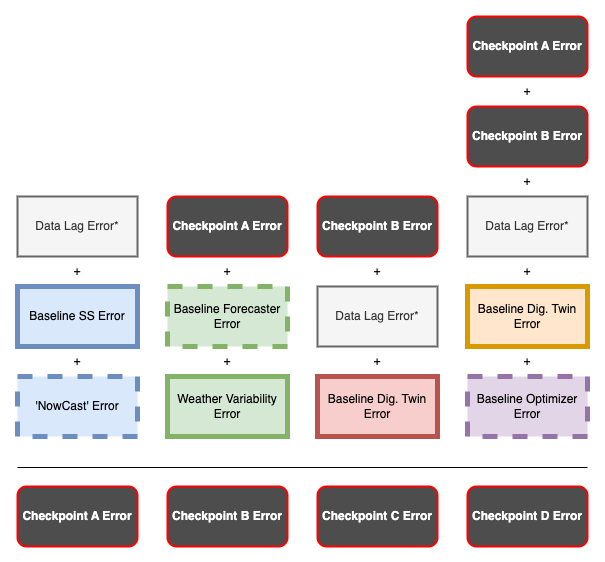

# CWS Durham ODIN Component Overview and Error Evaluation

## CWS Durham ODIN Components

The ODIN Hybrid Digital Twin Optimizer at CWS Durham consists of four ‘Core’ Components:

- [Primary Clarifier Influent Soft Sensor Model (SS)](link-to-more-info)
- [ML ‘Next Day’ Forecaster Model (NDF)](link-to-more-info)
- [Primary Clarifier Effluent Model (PCEM)](link-to-more-info)
- [One-Shot ML Simulator/Optimizer Model (OSSM)](link-to-more-info)

...and three 'Data Processing' Components:
- [Data Ingestion](link-to-more-info)
- [Data Cleaning](link-to-more-info)
- [Model Autocalibration](link-to-more-info)

### Functions of ODIN Core Components

- **SS:** Calculate primary influent composition from facility aeration rates up to current time (‘NowCast’).
- **NDF:** Forecast primary influent composition over the next 24 hours.
- **PCEM:** Calculate primary clarifier effluent flow and composition.
- **OSSM:** Forecast optimized alum dosing recommendations from observed/forecasted influent and effluent flows/compositions, and select calibration values.

### Core Component Functioning when ODIN is run (daily at 0700 PT)

#### Figure 1. Diagram of CWS Durham ODIN Production Run.

Core component functions when ODIN is run are diagrammed in Figure 1 and described as follows:

- **Prod. Step 1:** SS generates primary influent profiles up to ‘now’.
- **Prod. Step 2:** PCEM1 calculates the primary effluent composition and flows up to the current time.
- **Prod. Step 3:** The last 3 days of SS generated influent profiles are used to generate next 24 hours of influent profiles.
- **Prod. Step 4:** The last 2 days of primary influent profiles + 1 day of forecasted primary influent profiles, last 3 days of primary effluent loads, last 3 days of select calibration values (iCV_XB, qFloc_Me, qHAOH_aging, fxTSS_sludgebase), and the selected primary effluent orthophosphate load target are input into the OSSM.
- **Prod. Step 5:** PCEM2 calculates the next 24 hours primary effluent composition and flows based on NDF results.
- **Prod. Step 6:** OSSM generates a recommended alum dosing value.

#### Development Only Steps

- The use of SS results to train the NDF model.
- The use of PCEM/SS results to train the OSSM model.

### Direct Relationships between ODIN Core Components

- **SS to NDF:**
  - NDF model is trained on SS results.
  - SS results are used as inputs for NDF model.
- **SS to PCEM:**
  - SS and PCEM are different parts of the SUMO model.
- **NDF to PCEM:**
  - NDF results are fed to PCEM to generate next day effluent forecasts.
- **PCEM to OSSM:**
  - OSSM model is trained on PCEM results.
- **SS to NDF to PCEM to OSSM:**
  - SS/NDF/PCEM results are used as inputs for OSSM model.

## ODIN System Error Breakdown

### Baseline Errors

Each Core Component has its own distinct 'baseline' error. These errors are quantified during model development stages and are essentially model errors when given ‘perfect’ scenarios, meaning not missing data and without uncertainty of inputs. In reference to ML models these values come from the average error of validation sets for each of the 5 k-folds used during training. Error of the respective model outputs can be evaluated against observed values at CWS Durham with mean average percentage error (MAPE) used as preferred metric.

- **Baseline SS Error**
    - *Primary Influent Daily Flow (MGD)* - **MAPE: (0.0 ± 0.0%)**
        - Average Observed Value: (?.? ± ?.?)
        - Average Predicted Value: (?.? ± ?.?)
        
    - *Primary Influent Orthophosphate Load (lbs/day)* - **MAPE: (?.? ± ?.?%)**
        - Average Observed Value: (?.? ± ?.?)
        - Average Predicted Value: (?.? ± ?.?)

    - *Primary Influent Ammonia Load (lbs/day)* - **MAPE: (?.? ± ?.?%)**
        - Average Observed Value: (?.? ± ?.?)
        - Average Predicted Value: (?.? ± ?.?)

- **Baseline NDF Error**
     - *Primary Influent Daily Flow (MGD)* - **MAPE: (?.? ± ?.?%)**
        - Average Observed Value: (?.? ± ?.?)
        - Average Predicted Value: (?.? ± ?.?)
        
    - *Primary Influent Orthophosphate Load (lbs/day)* - **MAPE: (?.? ± ?.?%)**
        - Average Observed Value: (?.? ± ?.?)
        - Average Predicted Value: (?.? ± ?.?)

    - *Primary Influent Ammonia Load (lbs/day)* - **MAPE: (?.? ± ?.?%)**
        - Average Observed Value: (?.? ± ?.?)
        - Average Predicted Value: (?.? ± ?.?)

- **Baseline PCEM Error**
     - *Primary Effluent Daily Flow (MGD)* - **MAPE: (?.? ± ?.?%)**
        - Average Observed Value: (?.? ± ?.?)
        - Average Predicted Value: (?.? ± ?.?)
        
    - *Primary Effluent Orthophosphate Load (lbs/day)* - **MAPE: (?.? ± ?.?%)**
        - Average Observed Value: (?.? ± ?.?)
        - Average Predicted Value: (?.? ± ?.?)

    - *Primary Effluent Ammonia Load (lbs/day)* - **MAPE: (?.? ± ?.?%)**
        - Average Observed Value: (?.? ± ?.?)
        - Average Predicted Value: (?.? ± ?.?)

- **Baseline OSSM Error**
    - *Primary Clarifier Alum Dosing Conc. (g/ml)* - **MAPE: (?.? ± ?.?%)**
        - Average Observed Value: (?.? ± ?.?)
        - Average Predicted Value: (?.? ± ?.?)

### Production Environment Error Sources

Furthermore in a production environment other error sources are introduced beyond baseline errors due to data issues and future state uncertainties. These directly impact the core components but are herein treated independently:

- Data Related Errors
- Short-Range Forecasting of Aeration Rates
- Weather Forecast Variability

#### Production Environment Error Explanations and Assessments

Here are explanations of these errors and ways they can be assessed either directly or indirectly through downstream effects:

- **Data Error**
  - This relates to all data related errors including missing data, data delays, incorrect cleaning, and incorrect autocalibration. This most specifically applies to laboratory data (LIMs) (and to a lesser degree SCADA data) that are used as part of the SUMO SS and PCEM models. We can get an indirect estimate of the effect of delayed data impact through comparing live model evaluation periods vs. historical evaluation periods.

- **Short-Range Forecasting or ‘NowCast’ of Aeration Rates**
  - Due to the need to generate influent profiles from aeration rates there is a delay that is equal to the HRT from primary influent past aeration stage that results in the need to forecast or ‘NowCast’ the last 12 hours of aeration rates to generate expected influent profiles up to the current time. We can use the last 12 hours (1900-0700) of the first run versus the corrected time period the following day to get a measure of the percent error of the short-range forecast.

- **Weather Forecast Variability**
  - The NDF is trained on observed weather data, however, weather forecasts must be used for future forecasting of influent flows. We can measure the difference between expected weather conditions and observed weather conditions over the same time period.

### Error Checkpoints in Production Workflow

Instead of focusing solely on directly measuring these challenging 'production environment error' sources, our primary interest lies in understanding their impact on overall error within a production workflow environment. To achieve this, we have established a series of 'checkpoints' throughout the workflow. These checkpoints allow us to monitor and track how errors propagate through the entire production process. This approach is visually detailed in Figure 2 below.

#### Figure 2. Diagram of CWS ODIN Error Checkpoints.

Each checkpoint is some combination of baseline error, production environment error, and/or previous checkpoint error. Figure 3 shows how the error stacks for each checkpoint ultimately resulting in the observed error of Checkpoint D:

#### Figure 3. Diagram of CWS ODIN Error Stacking for each Checkpoint.

## Error Evaluation

### Evaluation Periods

We differentiate between two types of evaluations: historical evaluations, which do not account for data delay errors, and live model evaluations, which do include these errors. The specific time frames for these evaluations are:

- **Historical Evaluation Period 1:** April 1, 2023 to June 30th, 2023
- **Historical Evaluation Period 2:** July 1, 2023 to September 30, 2023
- **Live Model Evaluation Period 1:** October 1, 2023 to December 31, 2023* 

These evaluation periods are also distinct because they use different machine learning (ML) models, each tailored to their respective time frames. For each period, we employ ML models that were exclusively trained and validated with data gathered before the commencement of that period. The live model evaluation period, in particular, aligns with the active operation of the SS model, reflecting its performance since its most recent update.

All checkpoint error is determined by comparing data values at the checkpoint versus data observed and recorded at CWS Durham during that day with mean average percent error (MAPE) being the preferred metric.

### Error Checkpoint A

Checkpoint A is the amalgamation of data errors, baseline error of SS, and error of the short-range ‘NowCast’ that is part of the SS functioning. Data errors related to data input delays only impact results of the Live Model Eval Periods. The notebook for Checkpoint A evaluation can be found [here](link-to-notebook).

- **Historical Evaluation Period 1**
    - *Primary Influent Daily Flow (MGD)* - **MAPE: (0.0 ± 0.0%)**
        - Average Observed Value: (?.? ± ?.?)
        - Average Predicted Value: (?.? ± ?.?)
        
    - *Primary Influent Orthophosphate Load (lbs/day)* - **MAPE: (?.? ± ?.?%)**
        - Average Observed Value: (?.? ± ?.?)
        - Average Predicted Value: (?.? ± ?.?)

    - *Primary Influent Ammonia Load (lbs/day)* - **MAPE: (?.? ± ?.?%)**
        - Average Observed Value: (?.? ± ?.?)
        - Average Predicted Value: (?.? ± ?.?)

 

- **Historical Evaluation Period 2**
    - *Primary Influent Daily Flow (MGD)* - **MAPE: (0.0 ± 0.0%)**
        - Average Observed Value: (?.? ± ?.?)
        - Average Predicted Value: (?.? ± ?.?)
        
    - *Primary Influent Orthophosphate Load (lbs/day)* - **MAPE: (?.? ± ?.?%)**
        - Average Observed Value: (?.? ± ?.?)
        - Average Predicted Value: (?.? ± ?.?)

    - *Primary Influent Ammonia Load (lbs/day)* - **MAPE: (?.? ± ?.?%)**
        - Average Observed Value: (?.? ± ?.?)
        - Average Predicted Value: (?.? ± ?.?)

 

- **Live Model Evaluation Period 1**
    - *Primary Influent Daily Flow (MGD)* - **MAPE: (0.0 ± 0.0%)**
        - Average Observed Value: (?.? ± ?.?)
        - Average Predicted Value: (?.? ± ?.?)
        
    - *Primary Influent Orthophosphate Load (lbs/day)* - **MAPE: (?.? ± ?.?%)**
        - Average Observed Value: (?.? ± ?.?)
        - Average Predicted Value: (?.? ± ?.?)

    - *Primary Influent Ammonia Load (lbs/day)* - **MAPE: (?.? ± ?.?%)**
        - Average Observed Value: (?.? ± ?.?)
        - Average Predicted Value: (?.? ± ?.?)

 

### Error Checkpoint B

Checkpoint B combines the error of Checkpoint A with the error of the NDF model including the error introduced by weather variability associated with weather forecasts. Data errors related to data input delays that are associated with Checkpoint A are only included in the Live Model Eval Periods. The notebook for Checkpoint B evaluation can be found [here](link-to-notebook).

- **Historical Evaluation Period 1**
    - *Primary Influent Daily Flow (MGD)* - **MAPE: (0.0 ± 0.0%)**
        - Average Observed Value: (?.? ± ?.?)
        - Average Predicted Value: (?.? ± ?.?)
        
    - *Primary Influent Orthophosphate Load (lbs/day)* - **MAPE: (?.? ± ?.?%)**
        - Average Observed Value: (?.? ± ?.?)
        - Average Predicted Value: (?.? ± ?.?)

    - *Primary Influent Ammonia Load (lbs/day)* - **MAPE: (?.? ± ?.?%)**
        - Average Observed Value: (?.? ± ?.?)
        - Average Predicted Value: (?.? ± ?.?)

 

- **Historical Evaluation Period 2**
    - *Primary Influent Daily Flow (MGD)* - **MAPE: (0.0 ± 0.0%)**
        - Average Observed Value: (?.? ± ?.?)
        - Average Predicted Value: (?.? ± ?.?)
        
    - *Primary Influent Orthophosphate Load (lbs/day)* - **MAPE: (?.? ± ?.?%)**
        - Average Observed Value: (?.? ± ?.?)
        - Average Predicted Value: (?.? ± ?.?)

    - *Primary Influent Ammonia Load (lbs/day)* - **MAPE: (?.? ± ?.?%)**
        - Average Observed Value: (?.? ± ?.?)
        - Average Predicted Value: (?.? ± ?.?)

 

- **Live Model Eval Period 1**
    - *Primary Influent Daily Flow (MGD)* - **MAPE: (0.0 ± 0.0%)**
        - Average Observed Value: (?.? ± ?.?)
        - Average Predicted Value: (?.? ± ?.?)
        
    - *Primary Influent Orthophosphate Load (lbs/day)* - **MAPE: (?.? ± ?.?%)**
        - Average Observed Value: (?.? ± ?.?)
        - Average Predicted Value: (?.? ± ?.?)

    - *Primary Influent Ammonia Load (lbs/day)* - **MAPE: (?.? ± ?.?%)**
        - Average Observed Value: (?.? ± ?.?)
        - Average Predicted Value: (?.? ± ?.?)

 

### Error Checkpoint C

Checkpoint C is the resultant error of  Checkpoint B along with additional data errors associated with PCEM inputs and baseline error of the PCEM model. Data errors related to data input delays are only included in the Live Model Eval Periods. The notebook for Checkpoint C evaluation can be found [here](link-to-notebook).

- **Historical Evaluation Period 1**
    - *Primary Effluent Daily Flow (MGD)* - **MAPE: (0.0 ± 0.0%)**
        - Average Observed Value: (?.? ± ?.?)
        - Average Predicted Value: (?.? ± ?.?)
        
    - *Primary Effluent Orthophosphate Load (lbs/day)* - **MAPE: (?.? ± ?.?%)**
        - Average Observed Value: (?.? ± ?.?)
        - Average Predicted Value: (?.? ± ?.?)

    - *Primary Effluent Ammonia Load (lbs/day)* - **MAPE: (?.? ± ?.?%)**
        - Average Observed Value: (?.? ± ?.?)
        - Average Predicted Value: (?.? ± ?.?)

 

- **Historical Eval Period 2**
    - *Primary Effluent Daily Flow (MGD)* - **MAPE: (0.0 ± 0.0%)**
        - Average Observed Value: (?.? ± ?.?)
        - Average Predicted Value: (?.? ± ?.?)
        
    - *Primary Effluent Orthophosphate Load (lbs/day)* - **MAPE: (?.? ± ?.?%)**
        - Average Observed Value: (?.? ± ?.?)
        - Average Predicted Value: (?.? ± ?.?)

    - *Primary Effluent Ammonia Load (lbs/day)* - **MAPE: (?.? ± ?.?%)**
        - Average Observed Value: (?.? ± ?.?)
        - Average Predicted Value: (?.? ± ?.?)

 

- **Live Model Eval Period 1**
    - *Primary Effluent Daily Flow (MGD)* - **MAPE: (0.0 ± 0.0%)**
        - Average Observed Value: (?.? ± ?.?)
        - Average Predicted Value: (?.? ± ?.?)
        
    - *Primary Effluent Orthophosphate Load (lbs/day)* - **MAPE: (?.? ± ?.?%)**
        - Average Observed Value: (?.? ± ?.?)
        - Average Predicted Value: (?.? ± ?.?)

    - *Primary Effluent Ammonia Load (lbs/day)* - **MAPE: (?.? ± ?.?%)**
        - Average Observed Value: (?.? ± ?.?)
        - Average Predicted Value: (?.? ± ?.?)

 

### Error Checkpoint D

Checkpoint D or the optimized recommendation error represents the cumulative error comprising several elements: the errors from Checkpoints A and B, various data-related errors, and the baseline errors of both the PCEM and OSSM. Since the recommended actions were not implemented, we evaluate the accuracy of these recommendations by comparing 'adjusted' recommendations using next days observed primary effluent orthophosphate loads as designated 'target' with the actual alum dosing concentration observed following day. This comparison helps us assess the deviation of the suggested dosing from the actual dosing observed. However, it's important to note that during the live model evaluation period, alum dosing was not being conducted. Therefore, the results from this period do not apply to situations where alum dosing is active. The notebook for Checkpoint D evaluation can be found [here](link-to-notebook).

- **Historical Evaluation Period 1**
    - *Primary Clarifier Alum Dosing Conc. (g/ml)* - **MAPE: (0.0 ± 0.0%)**
        - Average Observed Value: (?.? ± ?.?)
        - Average Predicted Value: (?.? ± ?.?)

 

- **Historical Evaluation Period 2**
    - *Primary Clarifier Alum Dosing Conc. (g/ml)* - **MAPE: (0.0 ± 0.0%)**
        - Average Observed Value: (?.? ± ?.?)
        - Average Predicted Value: (?.? ± ?.?)

 

- **Live Model Evaluation Period 1**
  - N/A

 

### Production Environment Error

Some of the production environment error can be indirectly or directly assesed either by impact on checkpoint accuracy or by error of the forecast itself.

#### Data Lag Error

Because data lag did not occur during the live model eval period we can compare live model eval period results to historical eval period results where data lag was the only change to get a rough estimate of impact of the data lag. However, since there were no alum dosing during the live model eval period this does not apply to Checkpoint D.

- **Average Change of MAPE Between Historical Evaluation Period (n=2) and Live Model Eval Period (n=1) (Data Lag Impact)**
    - Checkpoint A Historical vs. Checkpoint A Live (?.?%) (?.?%) (?.?%)
    - Checkpoint B Historical vs. Checkpoint B Live (?.?%) (?.?%) (?.?%)
    - Checkpoint C Historical vs. Checkpoint C Live (?.?%) (?.?%) (?.?%)

#### Short-Range Forecasting 'NowCast' Error

The accuracy of the 'NowCast' can be directly assessed by comparing it with corrected values. These corrected values are recorded when the soft sensor is run the next day, ensuring that the inputs used for comparison are accurate. This comparison focuses on the forecasted aeration rate error across different evaluation periods:

- **Forecasted Aeration Rate Error**
    - Historical Eval Period 1 (?.?%)
    - Historical Eval Period 2 (?.?%)
    - Live Model Eval Period 1 (?.?%)

#### Weather Variability Error

With both forecasted and observed weather conditions available, we can quantify the error in specific weather metrics. This analysis focuses on the discrepancies between the forecasted and actual measurements.

- **Forecasted Temperature Error (Celsius)**
    - Historical Eval Period 1 (?.?%)
    - Historical Eval Period 2 (?.?%)
    - Live Model Eval Period 1 (?.?%)

- **Forecasted Precipation Error (mm)**
    - Historical Eval Period 1 (?.?%)
    - Historical Eval Period 2 (?.?%)
    - Live Model Eval Period 1 (?.?%)

#### Other Potential Error Sources

---